<div align="center">


# Кейсы с Барахлом

**Открывай кейсы. Выбивай носки. Продавай гуся. Не зли бабушку.**

Пародийная рулетка в духе открытия кейсов, только вместо оружия и ножей выпадают огурцы 2009 года, тапок-бабочка и ★ Шаурма | Легенда.


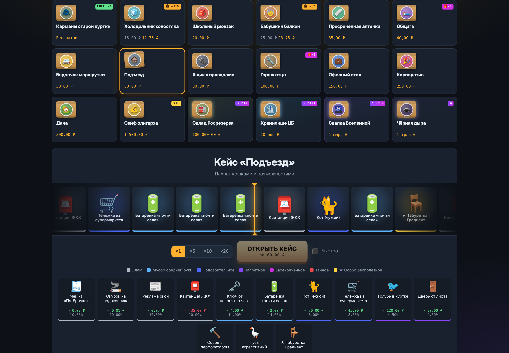

</div>

---

## Что внутри

**Кейсы**
- **18 кейсов и 211 предметов**: от бесплатных «Карманов старой куртки» до «Чёрной дыры» за 1 трлн ₽.
- **7 редкостей**: от «Хлама» до «★ Особо бесполезного», шансы опубликованы прямо под рулеткой.
- **Износ и СчётЧих™**: у каждого предмета свой износ, а с шансом 10% выпадает версия СчётЧих™ ×2.5.
- **Предметы с отрицательной ценой**: квитанция ЖКХ, кастрюля с жизнью, таракан Геннадий. Чтобы избавиться, придётся доплатить.
- **Открытие ×1, ×5, ×10 и ×20**: рулетки крутятся одновременно, при ×20 в две колонки.
- **Подарочные кейсы** за уровни тратятся первыми, недостающие докупаются.
- **Бесплатный кейс** копит заряды: +1 каждые 30 секунд, до 20 штук.

**Что делать с барахлом**
- **Инвентарь**: поиск, фильтры по редкости и кейсу, массовая продажа, дубликаты и закрепление ценного.
- **Музей барахла**: 19 залов и 230 экспонатов. Половина зала даёт первый бонус (кейс дешевле на 5%), полный зал — бонус покруче (−15% и СчётЧих™ вдвое чаще), весь музей — ещё −15% на все кейсы. У «Карманов старой куртки» и Мастерской бонусы свои: заряды копятся быстрее, поделки выходят лучше.
- **Мастерская**: 19 секретных рецептов с подсказками-загадками. «Носок без пары» + «Носок без пары» = ? Догадайся сам.
- **Реставрация**: снижай износ до «Атомарно чистого», если не жалко миллиардов.
- **Контракт обмена**: 10 предметов одной редкости превращаются в один предмет классом выше.
- **Апгрейд**: ставишь вещь, выбираешь множитель от ×1.5 до ×100 и крутишь колесо.

**И ещё**
- **Курс огурцов**: краш-игра, где нужно забрать выигрыш до того, как банка взорвётся.
- **Уровни**: звания от «Бомжа» до «Легенды помойки» и подарочные кейсы.
- **Бабушка-коллектор**: занимай, но помни, что при долге от 150 ₽ она может прийти в любой момент. Дождётся, пока докрутится кейс, постоит у двери 5 секунд и заберёт своё.
- **Лента дропов** с сотней вымышленных игроков вроде `Коллектор_Зинаида` и `HeadShot_Огурцом`.

## Скриншоты

| Выпадение | Открытие ×20 |
|---|---|
| 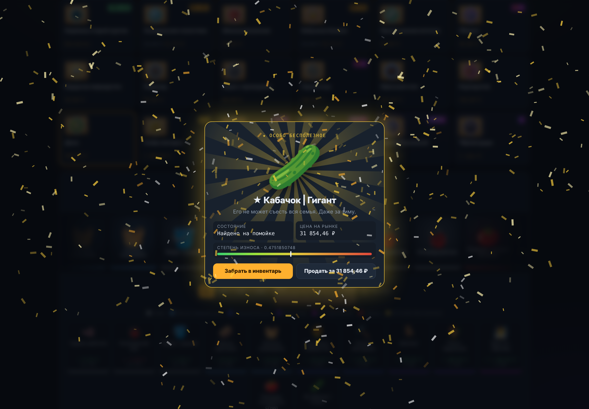 | 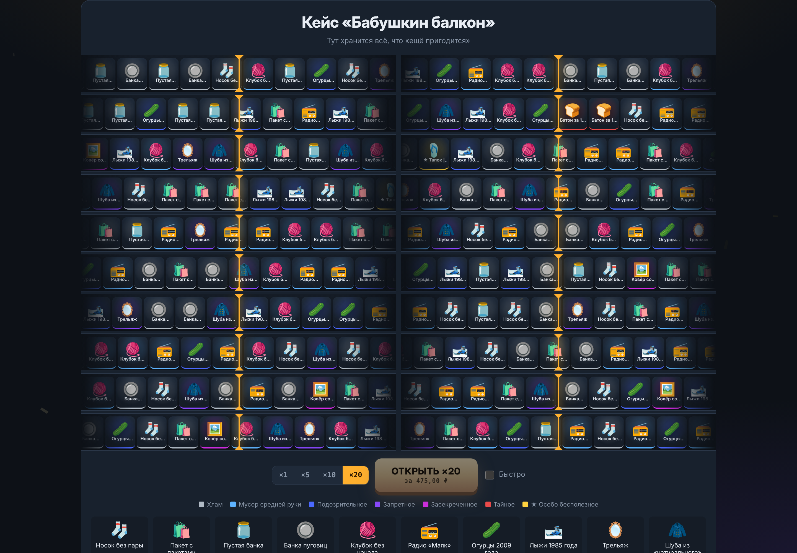 |

| Инвентарь и реставрация | Музей барахла |
|---|---|
| 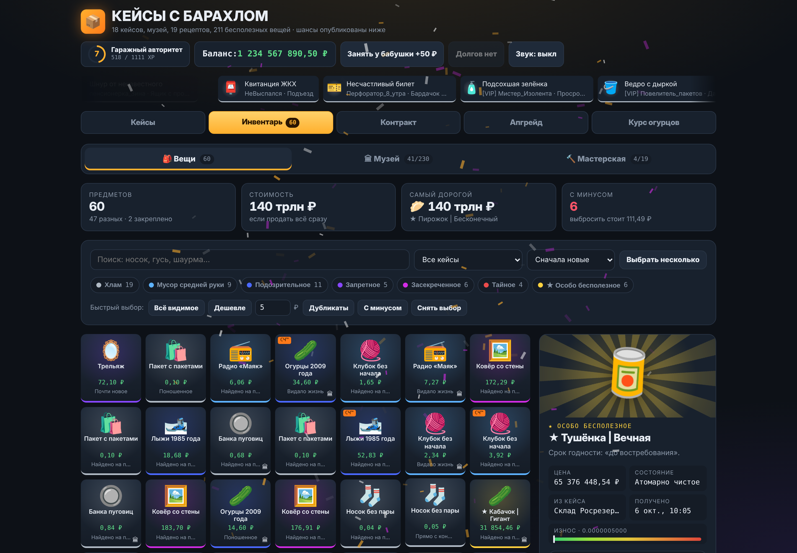 | 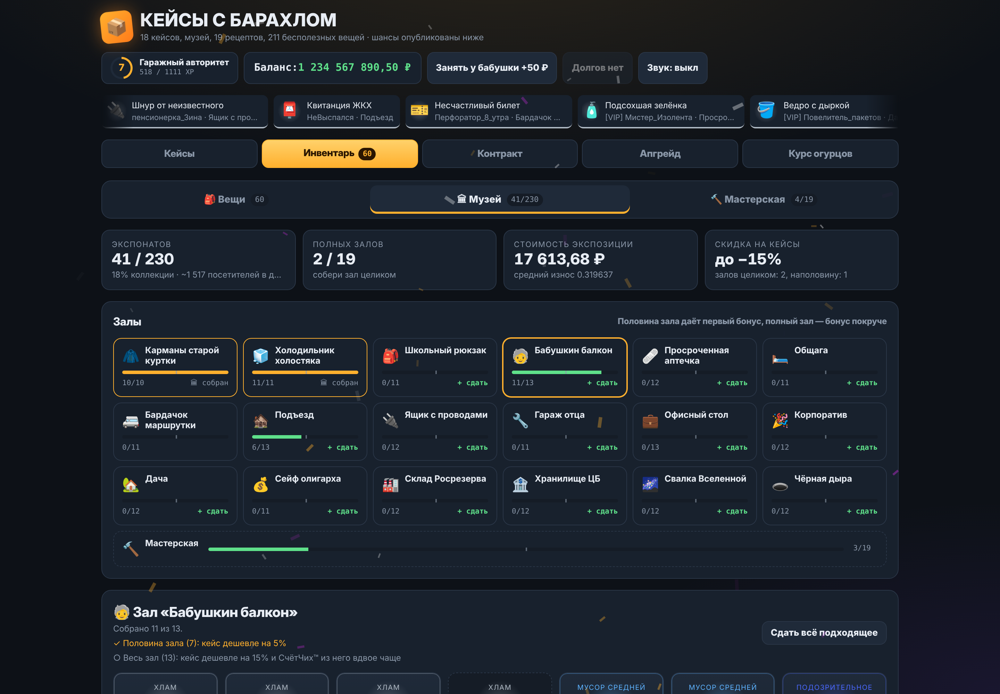 |

| Мастерская | Контракт обмена |
|---|---|
| 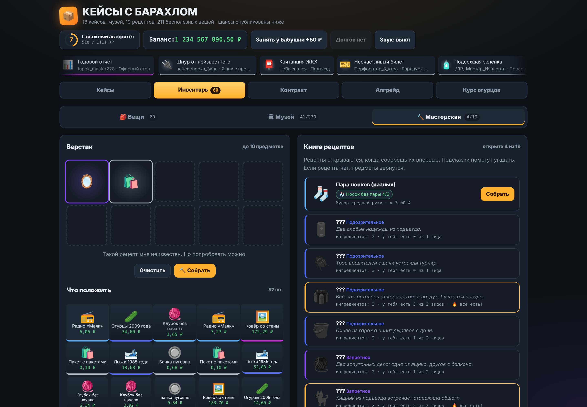 | 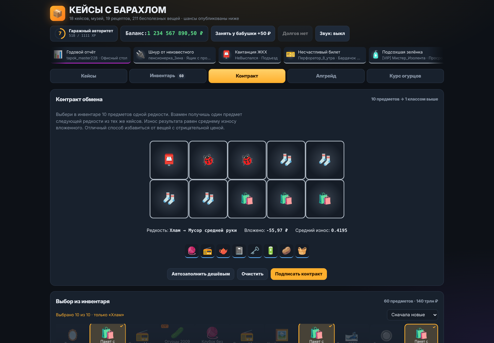 |

| Апгрейд | Курс огурцов |
|---|---|
| 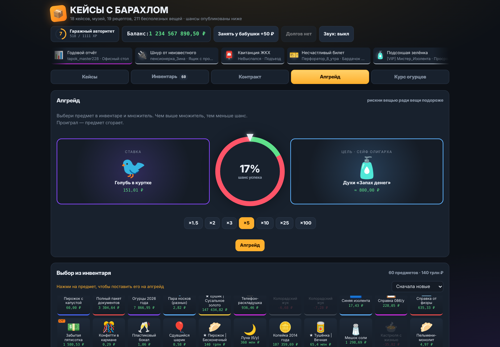 | 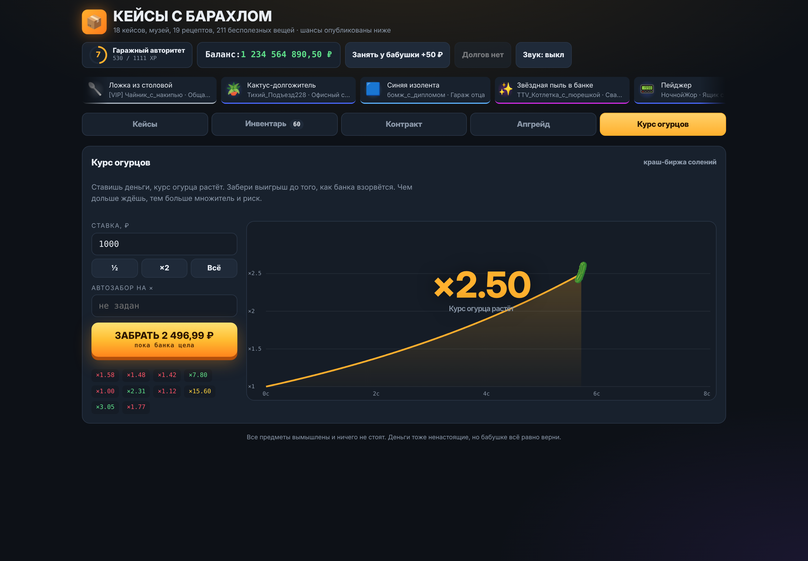 |

<p align="center">
  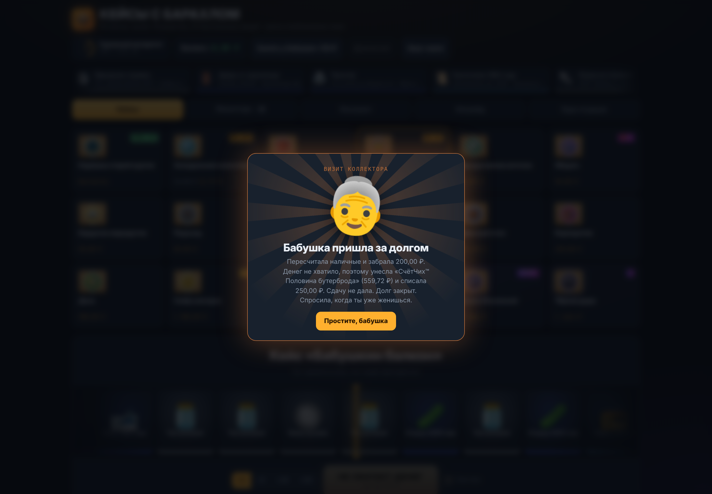
</p>

<p align="center">
  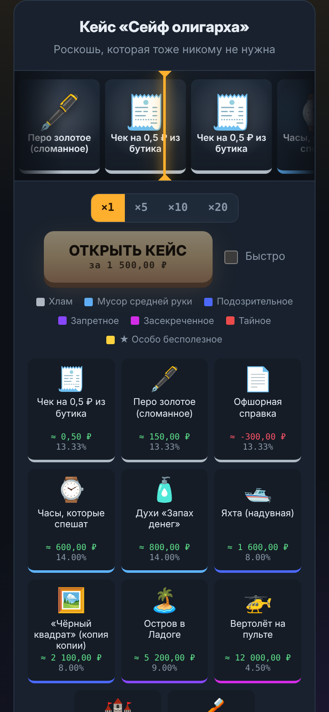
  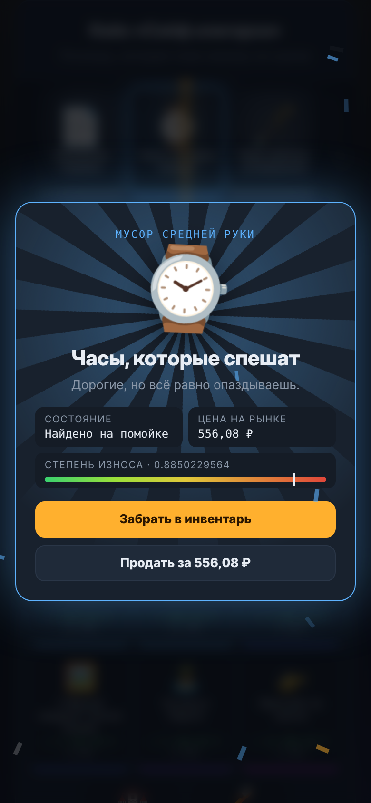
  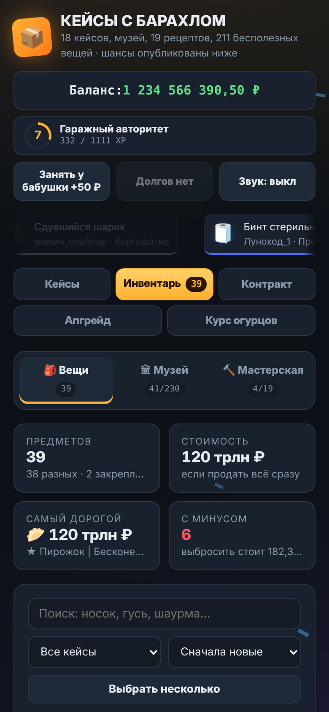
  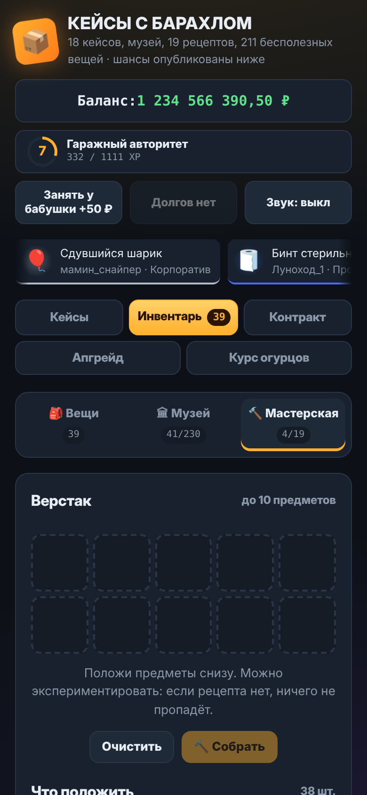
</p>

## Как запустить

**Просто поиграть.** Скачай репозиторий и открой `index.html` в браузере. Сборка не нужна.

**Локально, как настоящий сайт.** Чтобы работали установка и офлайн-режим, запусти в папке проекта любой статический сервер:

```bash
python -m http.server 8000   # или: npx serve
```

и открой `http://localhost:8000`.

**На GitHub Pages.** В репозитории уже есть workflow `.github/workflows/pages.yml`. Включи *Settings → Pages → Source → GitHub Actions*, и каждый пуш в `main` будет выкладывать свежую версию. Для публичных репозиториев это бесплатно.

**Как приложение (PWA).** Открой сайт и установи его:

- **Android, Chrome:** меню ⋮ → «Установить приложение»
- **iPhone, Safari:** «Поделиться» → «На экран Домой»
- **Компьютер, Chrome или Edge:** значок установки в адресной строке

После первого запуска игра работает без интернета.

## Устройство проекта

```
index.html                   вся игра: разметка, стили и логика
manifest.webmanifest         описание приложения для установки
sw.js                        service worker для офлайн-режима
icon-*.png                   иконки приложения
apple-touch-icon.png         иконка для iOS
.github/workflows/pages.yml  деплой на GitHub Pages
docs/                        логотип и скриншоты для README
CHANGELOG.md                 история версий
```

Весь код в `index.html` разбит на разделы по порядку: данные, настройки механик, состояние, механики, интерфейс, запуск. Настройки (шансы, кулдауны, наценки) собраны в одном месте в начале скрипта.

Прогресс хранится в `localStorage` браузера, онлайн-функций нет. Сохранения старых версий подхватываются автоматически. Случайные числа берутся из `crypto.getRandomValues`.

### Как добавить свой кейс

Найди в `index.html` массив `CASES` и добавь объект:

```js
{
  id: 'mycase', name: 'Мой кейс',
  desc: 'Описание',
  ic: '🎁', color: '#c0703a', price: 42,
  items: [
    // [редкость 0–6, эмодзи, название, описание, базовая цена ₽]
    [0, '🧦', 'Носок', 'Один.', 0.05],
    [6, '🌯', '★ Шаурма | Своя', 'Легенда.', 9999],
  ],
},
```

Зал в музее для него появится сам. Чтобы добавить рецепт, допиши объект в массив `RECIPES`: ингредиенты указываются по точным названиям предметов.

После изменений подними версию кэша в `sw.js` (например, `junkcase-v13` → `junkcase-v14`). Иначе у тех, кто уже установил приложение, останется старая версия.

## Ветки

- `main` — стабильная версия, которая публикуется на GitHub Pages.
- `unstable` — новые кейсы, механики и эксперименты. Может ломаться.

## Лицензия

[MIT](LICENSE). Все предметы вымышлены и ничего не стоят. Деньги тоже ненастоящие, но бабушке всё равно верни.
