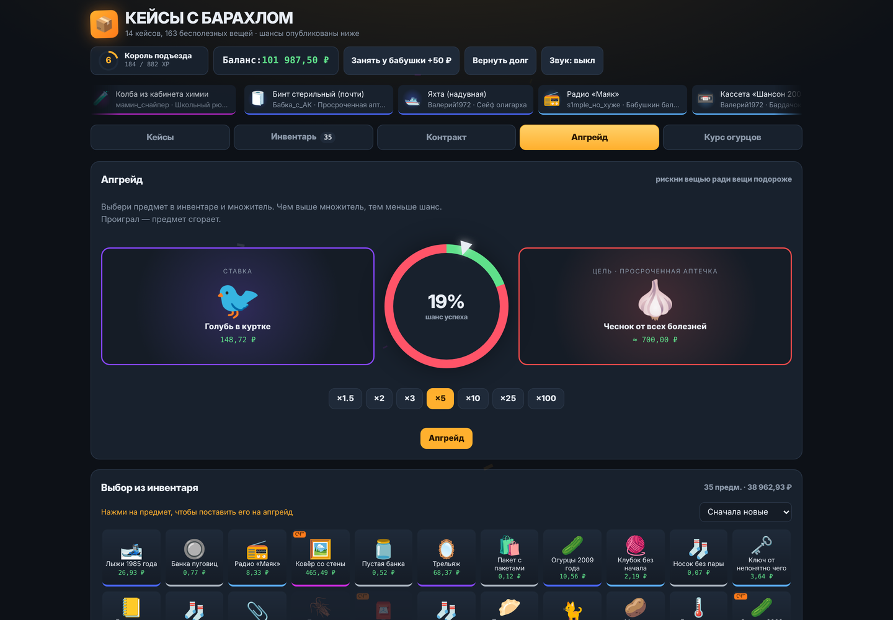
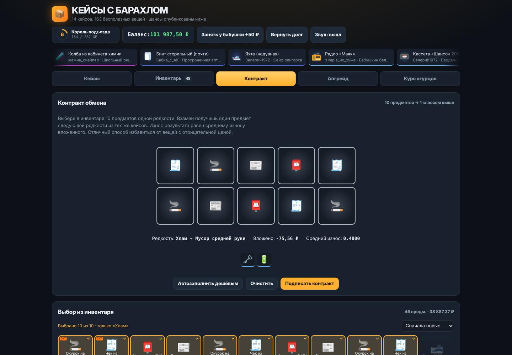
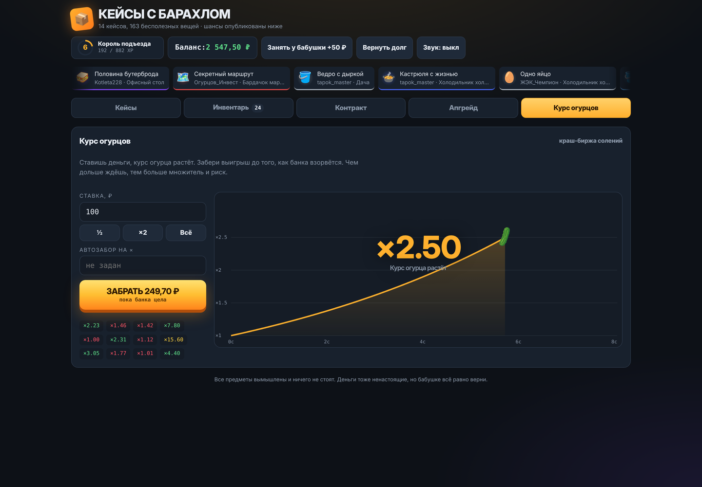
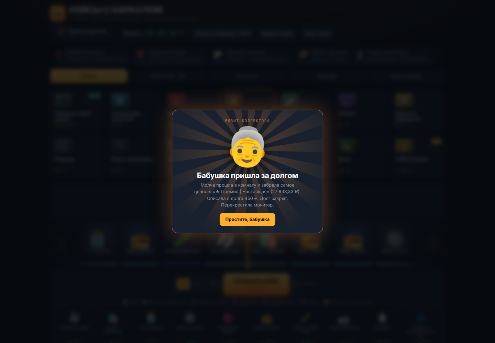
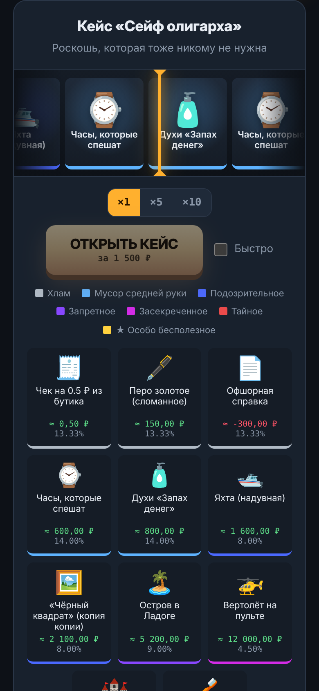
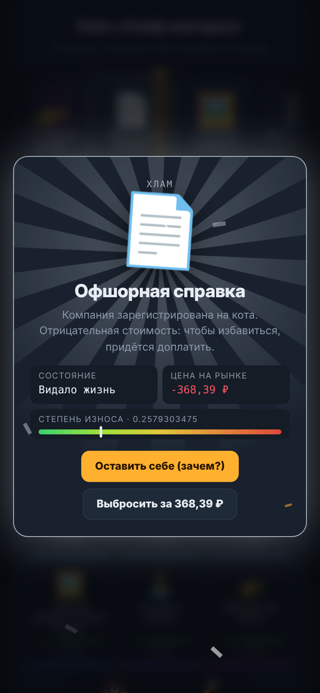
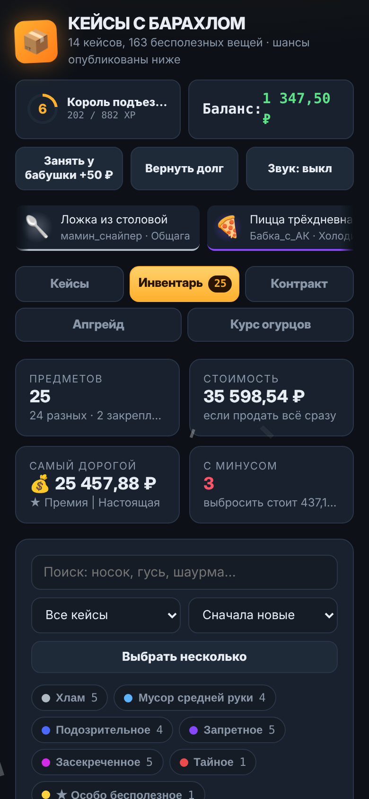
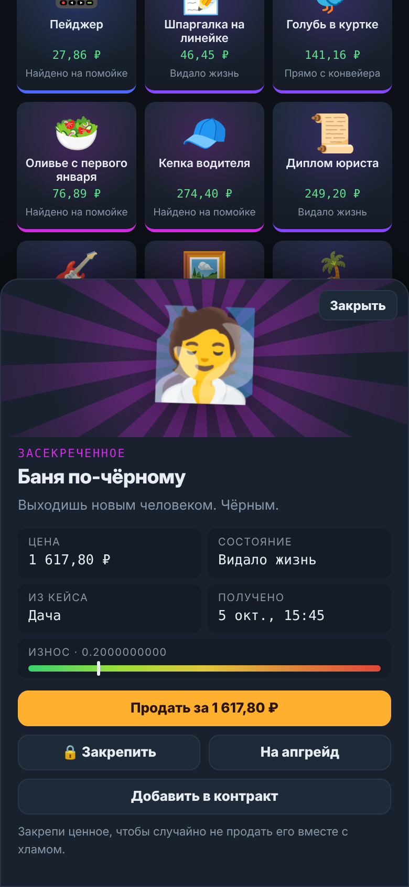

<div align="center">


# Кейсы с Барахлом

**Открывай кейсы. Выбивай носки. Продавай гуся. Не зли бабушку.**

Пародийная рулетка в духе открытия кейсов, только вместо оружия и ножей выпадают огурцы 2009 года, тапок-бабочка и ★ Шаурма | Легенда.


</div>

---

## Что внутри

- **14 кейсов и 163 предмета**: от «Карманов старой куртки» (бесплатно) до «Сейфа олигарха» за 1 500 ₽.
- **7 редкостей**: от «Хлама» до «★ Особо бесполезного», с честно опубликованными шансами.
- **Износ и СчётЧих™**: у каждого предмета свой float, а с шансом 10% выпадает версия СчётЧих™ ×2.5.
- **Предметы с отрицательной ценой**: квитанция ЖКХ, кастрюля с жизнью, таракан Геннадий. Чтобы избавиться, придётся доплатить.
- **Открытие ×1, ×5 и ×10**: несколько рулеток крутятся одновременно.
- **Контракт обмена**: 10 предметов одной редкости превращаются в один предмет классом выше.
- **Апгрейд**: ставишь вещь, выбираешь множитель от ×1.5 до ×100 и крутишь колесо.
- **Курс огурцов**: краш-игра, где нужно забрать выигрыш до того, как банка взорвётся.
- **Инвентарь**: поиск, фильтры, массовая продажа, дубликаты и закрепление ценного.
- **Уровни**: звания от «Бомжа» до «Легенды помойки» и подарочные кейсы.
- **Бабушка-коллектор**: занимай, но помни, что она придёт.

## Скриншоты

| Рулетка | Инвентарь |
|---|---|
|  |  |

| Апгрейд | Контракт обмена |
|---|---|
|  |  |

| Курс огурцов | Бабушка пришла за долгом |
|---|---|
|  |  |

<p align="center">
  
  
  
  
</p>

## Как запустить

**Просто поиграть.** Скачай репозиторий и открой `index.html` в браузере. Сборка и сервер не нужны.

**Как приложение (PWA).** Сайт публикуется через GitHub Actions: включи *Settings → Pages → Source → GitHub Actions*, и каждый пуш в `main` будет выкладывать свежую версию (workflow лежит в `.github/workflows/pages.yml`). Потом открой ссылку:

- **Android, Chrome:** меню ⋮ → «Установить приложение»
- **iPhone, Safari:** «Поделиться» → «На экран Домой»
- **Компьютер, Chrome или Edge:** значок установки в адресной строке

После первого запуска игра работает без интернета.

## Устройство проекта

```
index.html             вся игра: разметка, стили и логика
manifest.webmanifest   описание приложения для установки
sw.js                  service worker для офлайн-режима
icon-*.png             иконки приложения
docs/                  логотип и скриншоты для README
```

Прогресс хранится в `localStorage` браузера, онлайн-функций нет. Случайные числа берутся из `crypto.getRandomValues`.

### Как добавить свой кейс

Найди в `index.html` массив `CASES` и добавь объект:

```js
{id:'fridge2', name:'Мой кейс', desc:'Описание', ic:'🎁', color:'#c0703a', price:42, items:[
  // [редкость 0–6, иконка, название, описание, базовая цена ₽]
  [0,'🧦','Носок','Один.',.05],
  [6,'🌯','★ Шаурма | Своя','Легенда.',9999],
]},
```

После изменений подними версию кэша в `sw.js` (`junkcase-v1` → `junkcase-v2`). Иначе у тех, кто уже установил приложение, останется старая версия.

## Ветки

- `main` — стабильная версия, которая публикуется на GitHub Pages.
- `unstable` — новые кейсы, механики и эксперименты. Может ломаться.

## Лицензия

[MIT](LICENSE). Все предметы вымышлены и ничего не стоят. Деньги тоже ненастоящие, но бабушке всё равно верни.
