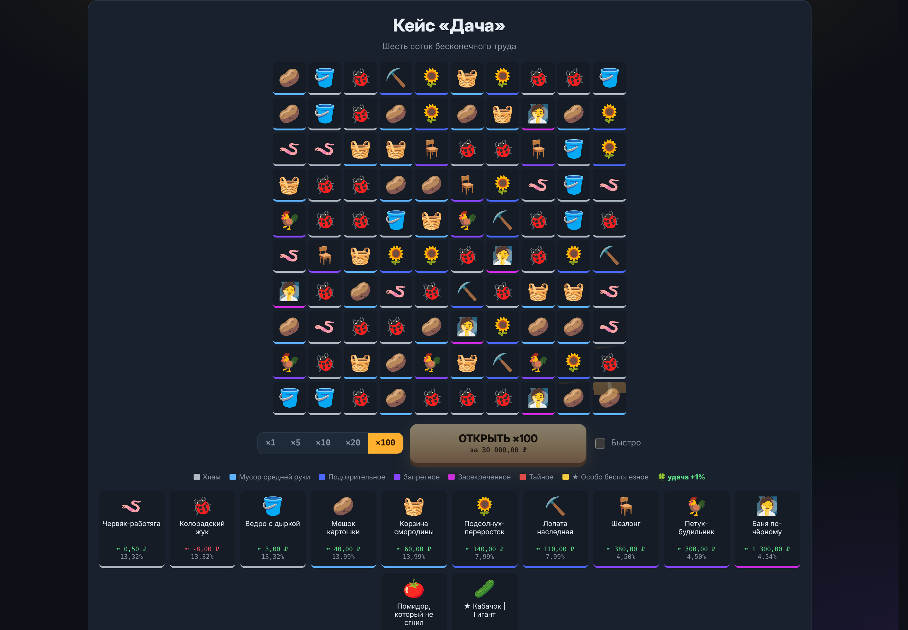
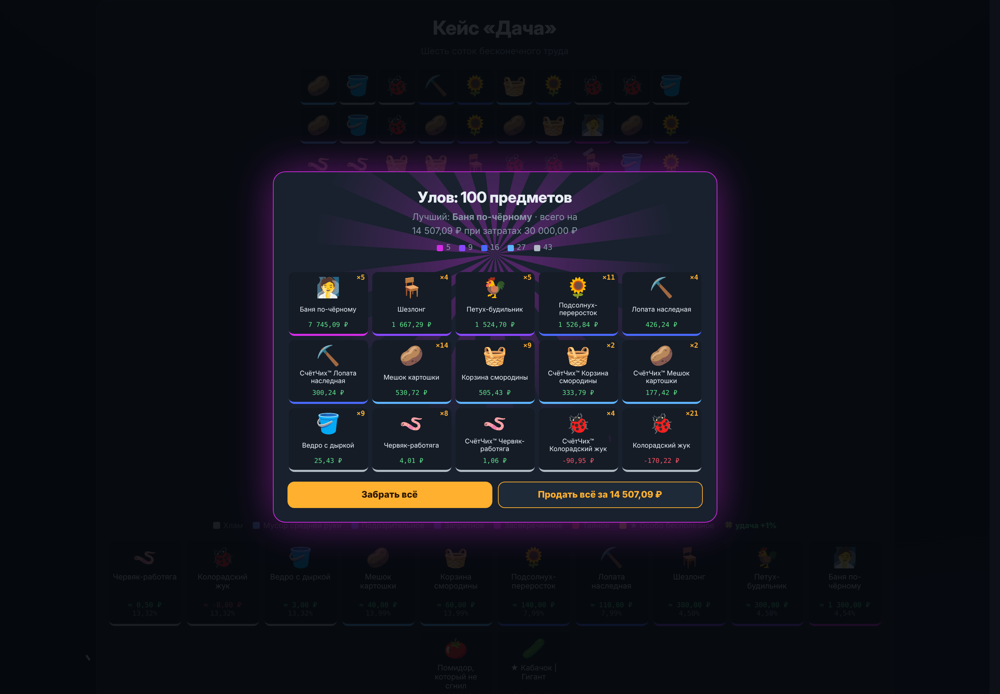
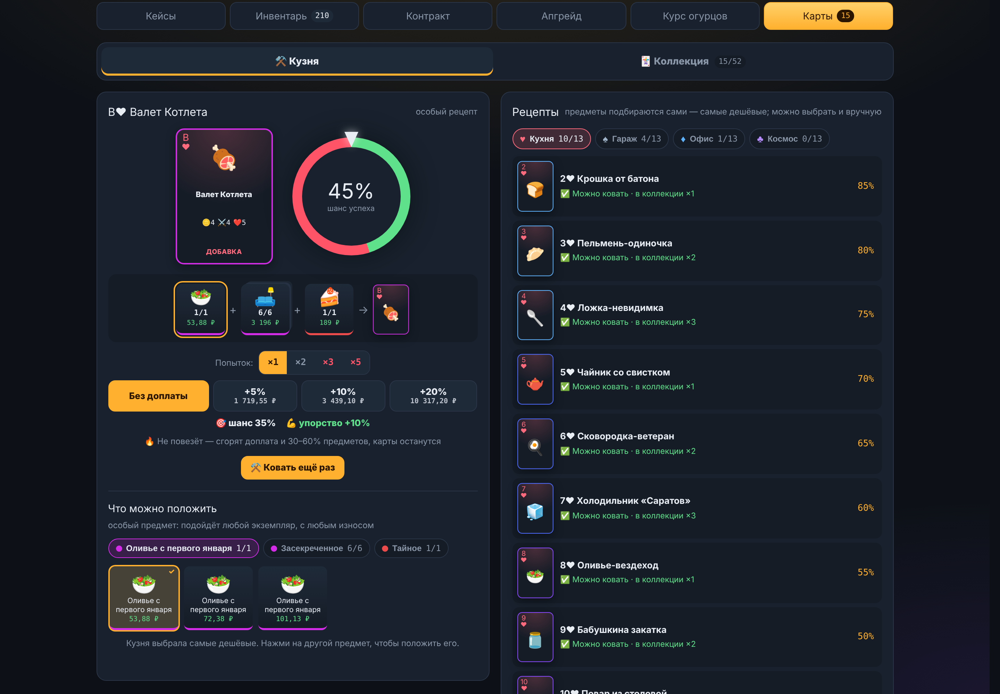
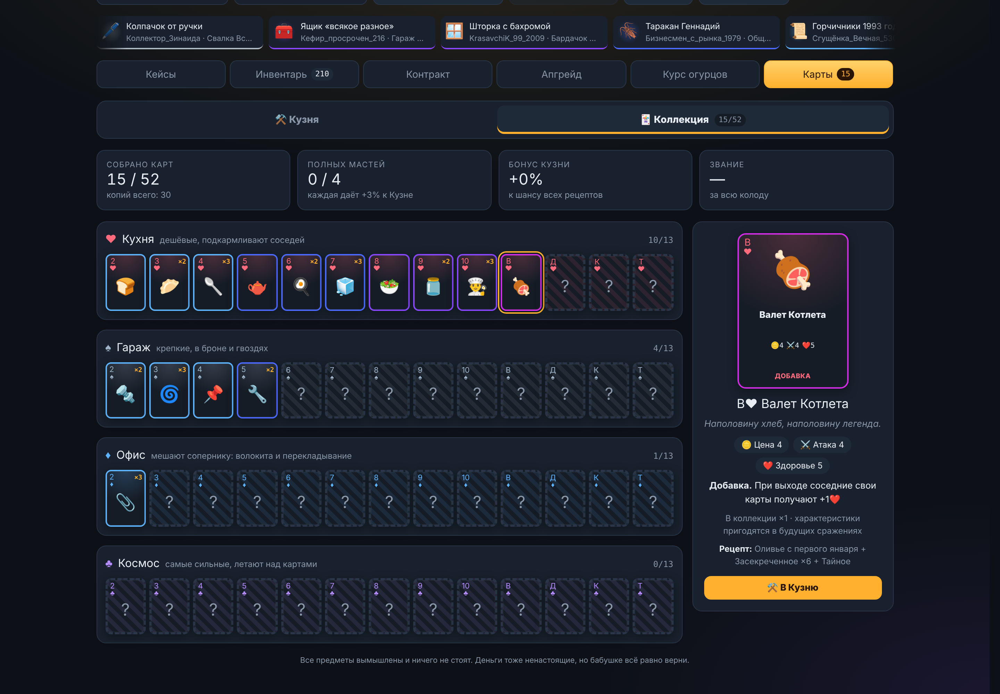
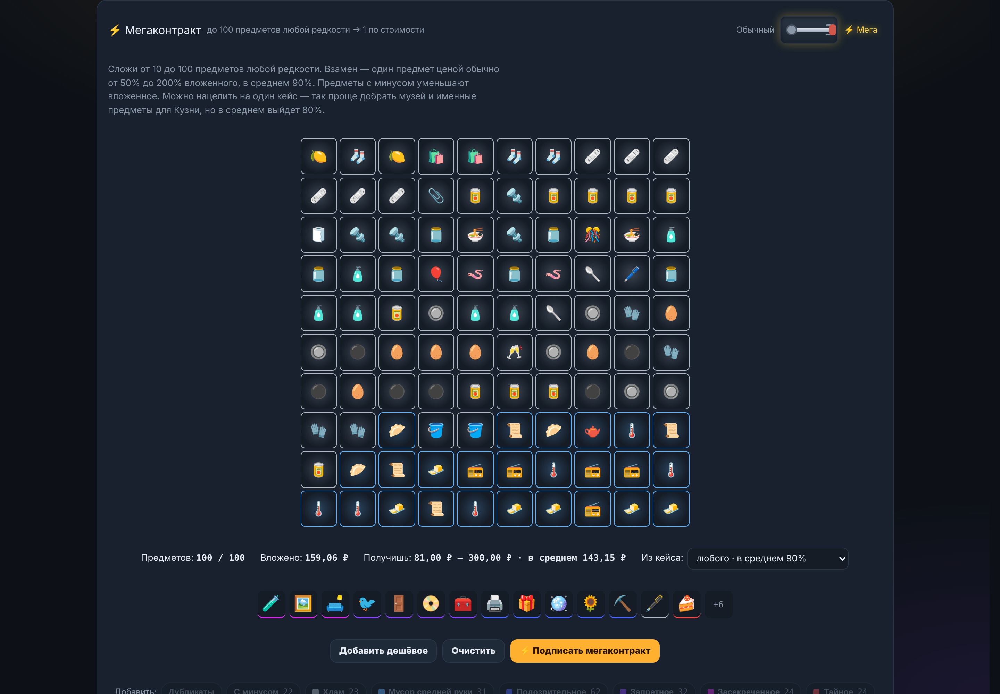
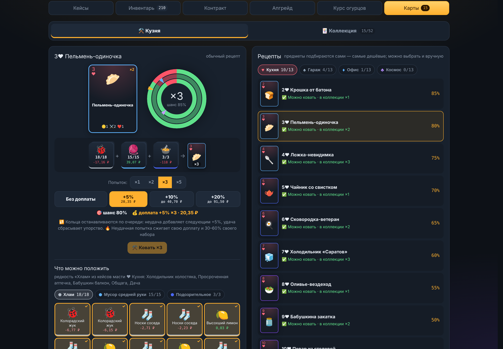
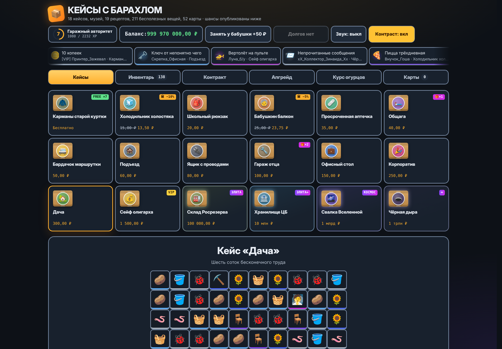

<div align="center">


# Кейсы с Барахлом

**Открывай кейсы. Выбивай носки. Продавай гуся. Не зли бабушку.**

Пародийная рулетка в духе открытия кейсов, только вместо оружия и ножей выпадают огурцы 2009 года, тапок-бабочка и ★ Шаурма | Легенда.


</div>

---

## Что внутри

**Кейсы**
- **18 кейсов и 211 предметов**: от бесплатных «Карманов старой куртки» до «Чёрной дыры» за 1 трлн ₽.
- **7 редкостей**: от «Хлама» до «★ Особо бесполезного», шансы опубликованы прямо под рулеткой.
- **Износ и СчётЧих™**: у каждого предмета свой износ, а с шансом 10% выпадает версия СчётЧих™ ×2.5.
- **Предметы с отрицательной ценой**: квитанция ЖКХ, кастрюля с жизнью, таракан Геннадий. Чтобы избавиться, придётся доплатить.
- **Открытие ×1, ×5, ×10, ×20 и ×100**: рулетки крутятся одновременно, при ×20 в две колонки, а при ×100 сетка коробок вскрывается волной.
- **Бафф после ×20 и ×100**: изредка (0,5% и 4%) два случайных кейса — из тех, что дешевле открытого, или следующий по цене — на минуту дают Тайное и ★ вдвое чаще.
- **Подарочные кейсы** за уровни тратятся первыми, недостающие докупаются.
- **Бесплатный кейс** копит заряды: +1 каждые 30 секунд, до 20 штук.

**Что делать с барахлом**
- **Инвентарь**: поиск, фильтры по редкости и кейсу, массовая продажа, дубликаты и закрепление ценного.
- **Музей барахла**: 19 залов и 230 экспонатов. Половина зала даёт первый бонус (кейс дешевле на 5%), полный зал — бонус покруче (−10% и СчётЧих™ вдвое чаще), весь музей — ещё −10% на все кейсы. У «Карманов старой куртки» и Мастерской бонусы свои: заряды копятся быстрее, поделки выходят лучше.
- **Мастерская**: 19 секретных рецептов с подсказками-загадками. «Носок без пары» + «Носок без пары» = ? Догадайся сам. Известные рецепты можно собрать пачкой по редкости.
- **Реставрация**: снижай износ до «Атомарно чистого», если не жалко миллиардов.
- **Контракт обмена**: 10 предметов одной редкости превращаются в один предмет классом выше из тех же кейсов — чем больше вложено из кейса, тем вероятнее результат из него. Износ результата заметно лучше вложенного, а заполнить контракт можно в один клик самыми дешёвыми нужной редкости.
- **Мегаконтракт** — дёрни рубильник: от 10 до 100 предметов любой редкости превращаются в один предмет по их общей стоимости (обычно от 0,5× до 2×, в среднем 0,9×). Можно нацелить на один кейс, чтобы добрать музей или именной предмет для Кузни. Выбранное в инвентаре отправляется туда одной кнопкой.
- **Апгрейд**: ставишь вещь, выбираешь множитель от ×1.5 до ×100 и крутишь колесо. Можно доплатить деньгами и поднять шанс до 75%.

**Карты**
- **Коллекция из 52 карт**: 4 масти по 13 — ♥ Кухня, ♠ Гараж, ♦ Офис и ♣ Космос, от двойки до туза. «Крошка от батона», «Дама Подъезда», «Туз Большой взрыв».
- **Кузня**: карты куются из барахла на колесе удачи. В каждом рецепте — «куча» предметов масти: много попроще, несколько поредше и 1–2 самых редких. Младшая карта нужна только шестёрке, десятке, даме и тузу, а семёрке, девятке и картинкам — именные предметы, которые до первой находки прячутся за загадками. Чем старше карта, тем ниже шанс; доплата его поднимает.
- **Слоты стопками и «Где взять»**: по стопке на требование — сколько набрано и на какую сумму. Для недостающего Кузня подскажет, в каких кейсах масти оно падает, сколько примерно открыть и во что это обойдётся. Предметы подбираются сами — самые дешёвые, а именные для старших карт идут в «кучу» последними; любой можно положить вручную.
- **Мультикрафт ×2, ×3, ×5**: несколько попыток одной карты разом — на колесе по кольцу на попытку, стрелки останавливаются по очереди, неудача добавляет следующим +5%.
- **Неудача не обнуляет**: сгорает только часть предметов, карты остаются, недостающее Кузня доберёт сама, а следующая попытка на 5% удачнее.
- **Альбом**: копии складываются, каждая собранная масть даёт +3% к шансам Кузни, вся колода — звание. Сражения на весах — в следующих версиях.

**И ещё**
- **Курс огурцов**: краш-игра, где нужно забрать выигрыш до того, как банка взорвётся.
- **Уровни**: 30 званий от «Бомжа» до «Абсолюта хлама», подарочные кейсы и удача, которая растёт с уровнем до +20%.
- **Контрастный режим** с жирными рамками для тех, кому так удобнее.
- **Бабушка-коллектор**: даёт в долг по 50 ₽, но не больше 3 000 ₽. При долге от 150 ₽ может прийти в любой момент: дождётся, пока докрутится кейс, постоит у двери 3 секунды и заберёт своё.
- **Сохранения в файл**: прогресс можно скачать и загрузить на другом устройстве. Файл защищён от правки, а прежний прогресс при загрузке остаётся запасной копией — его можно вернуть.
- **Лента дропов** с сотней вымышленных игроков вроде `Коллектор_Зинаида` и `HeadShot_Огурцом`.

## Скриншоты

| Выпадение | Открытие ×20 |
|---|---|
|  |  |

| Открытие ×100 | Улов ×100 |
|---|---|
|  |  |

| Инвентарь и реставрация | Музей барахла |
|---|---|
|  |  |

| Мастерская | Контракт обмена |
|---|---|
|  |  |

| Кузня карт | Коллекция карт |
|---|---|
|  |  |

| Мегаконтракт | Мультикрафт в Кузне |
|---|---|
|  |  |

| Апгрейд | Курс огурцов |
|---|---|
|  |  |

<p align="center">
  
</p>

<p align="center">
  
</p>

<p align="center">
  
  
  
  
</p>

## Как запустить

**Просто поиграть.** Скачай репозиторий и открой `index.html` в браузере. Сборка не нужна.

**Локально, как настоящий сайт.** Чтобы работали установка и офлайн-режим, запусти в папке проекта любой статический сервер:

```bash
python -m http.server 8000   # или: npx serve
```

и открой `http://localhost:8000`.

**На GitHub Pages.** В репозитории уже есть workflow `.github/workflows/pages.yml`. Включи *Settings → Pages → Source → GitHub Actions*, и каждый пуш в `main` будет выкладывать свежую версию. Для публичных репозиториев это бесплатно.

**Как приложение (PWA).** Открой сайт и установи его:

- **Android, Chrome:** меню ⋮ → «Установить приложение»
- **iPhone, Safari:** «Поделиться» → «На экран Домой»
- **Компьютер, Chrome или Edge:** значок установки в адресной строке

После первого запуска игра работает без интернета.

## Устройство проекта

```
index.html                   разметка и порядок подключения стилей и скриптов
styles/                      стили по разделам: база, шапка, кейсы, инвентарь, окна, адаптив…
scripts/
  data/                      кейсы, рецепты Мастерской, ники для ленты дропов, карты и рецепты Кузни
  core/                      настройки (config.js), состояние и сохранение, звук, эффекты,
                             предметы, уровни, кошелёк, навигация
  cases/                     сетка кейсов, рулетка и открытие, окна выпадения
  inventory/                 инвентарь, музей, Мастерская, реставрация, аналитика, сохранения
  modes/                     контракт, апгрейд, «Курс огурцов»
  cards/                     карты: каталог, Кузня, альбом коллекции
  ambient/                   бабушка-коллектор и лента дропов
  main.js                    запуск: первая отрисовка и фоновые таймеры
sw.js                        service worker для офлайн-режима
manifest.webmanifest         описание приложения для установки
icon-*.png                   иконки приложения
apple-touch-icon.png         иконка для iOS
tools/check_site.py          проверка, что все файлы подключены и попадут в офлайн-кэш
.github/workflows/pages.yml  деплой на GitHub Pages
docs/                        логотип и скриншоты для README
CHANGELOG.md                 история версий
```

Сборки нет: стили и скрипты — обычные файлы, подключённые в `index.html` по порядку. Скрипты не модули, поэтому игра открывается и просто как файл с диска. Все объявления у них общие, и порядок важен: каждый файл пользуется тем, что объявлено в предыдущих, а `main.js` идёт последним. Стили тоже подключаются по порядку: поздние правила перекрывают ранние, адаптив — в самом конце.

Общие настройки механик (шансы, кулдауны, наценки, потолок долга, мегаконтракт) собраны в `scripts/core/config.js`; настройки Кузни — в начале `scripts/cards/forge.js`, апгрейда — в `scripts/modes/upgrade.js`.

Прогресс хранится в `localStorage` браузера, онлайн-функций нет. Сохранения старых версий подхватываются автоматически. Случайные числа берутся из `crypto.getRandomValues`.

### Как добавить свой кейс

Открой `scripts/data/cases.js` и добавь в массив `CASES` объект:

```js
{
  id: 'mycase', name: 'Мой кейс',
  desc: 'Описание',
  ic: '🎁', color: '#c0703a', price: 42,
  items: [
    // [редкость 0–6, эмодзи, название, описание, базовая цена ₽]
    [0, '🧦', 'Носок', 'Один.', 0.05],
    [6, '🌯', '★ Шаурма | Своя', 'Легенда.', 9999],
  ],
},
```

Зал в музее для него появится сам. Чтобы добавить рецепт, допиши объект в массив `RECIPES` в `scripts/data/recipes.js`: ингредиенты указываются по точным названиям предметов.

### Новый файл стилей или скрипта

Подключи его в `index.html` в нужном месте и допиши в список `CORE` в `sw.js`, иначе он не попадёт в офлайн-кэш. Проверить, что ничего не забыто:

```bash
python3 tools/check_site.py
```

Эта же проверка запускается при каждом деплое.

### Версия кэша

При деплое на GitHub Pages версия кэша в `sw.js` сама получает хэш коммита, так что у тех, кто установил приложение, новая версия ставится целиком при следующем запуске. Если раздаёшь игру как-то иначе, подними номер версии `CACHE` в `sw.js` вручную (например, `junkcase-v1` → `junkcase-v2`).

## Ветки

- `main` — стабильная версия, которая публикуется на GitHub Pages.
- `unstable` — новые кейсы, механики и эксперименты. Может ломаться.

## Лицензия

[MIT](LICENSE). Все предметы вымышлены и ничего не стоят. Деньги тоже ненастоящие, но бабушке всё равно верни.
